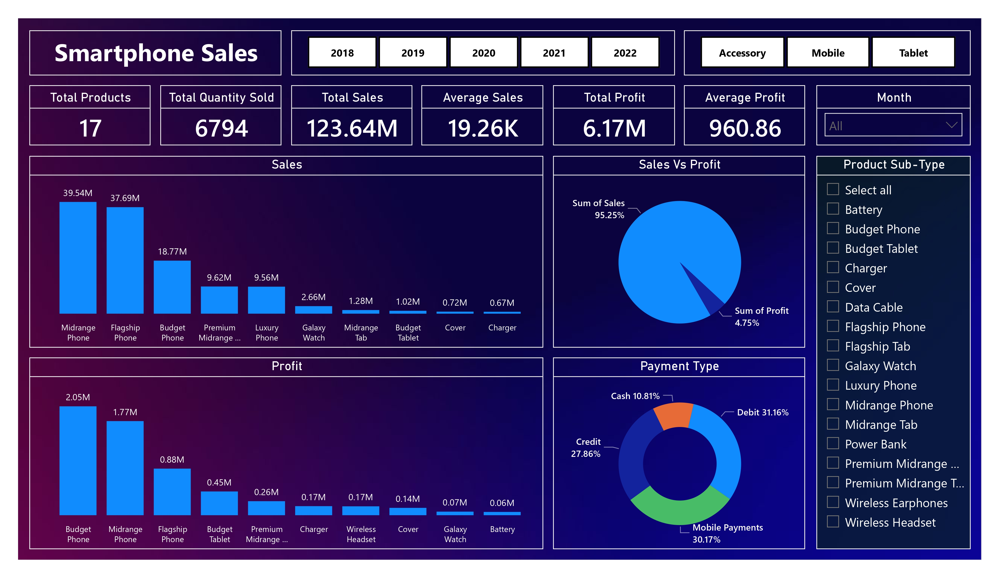

# Smart phone Analysis

This Project created by Nisrag Bsc.Data

## Table of Contents
- [Screenshots](#screenshots)
- [Features](#features)
- [Installation](#installation)

## Screenshots

Include screenshots or images showcasing your project. Use relative paths for images inside your project.




## Features

📊 Excited to share a dynamic Power BI dashboard showcasing smartphone sales performance from 2018 to 2022! 🚀

📈 Dive into the insights with user-friendly filters for year, category, and sub-category, making it easy to analyze trends and patterns. 

Here are some key KPIs to explore:
1️⃣ Total Products Sold
2️⃣ Total Quantity Sold
3️⃣ Total Sales
4️⃣ Average Sales
5️⃣ Total Profit
6️⃣ Average Profit

🔍 The dashboard is not just about numbers, but about visualizing the story. Check out these engaging charts:

📊 Sales Column Chart: Visualize the sales performance over the years, identifying peak seasons and areas for improvement.
💹 Profit Column Chart: Explore the profit margins with this detailed column chart, helping you pinpoint successful products and areas to optimize.
📊 Sales VS Profit Pie Diagram: A comprehensive view of the balance between sales and profit, guiding strategic decisions for future growth.
🍰 Payment Type Pie Diagram: Understand the preferred payment methods of our customers, aiding in tailoring our sales strategies.

🚀 This Power BI dashboard is a powerful tool to drive data-informed decisions, enhancing our understanding of the smartphone market dynamics. Let's leverage this valuable resource to propel our business to new heights! 💼📈 

## Installation

Provide instructions on how to install your project. You can include code snippets or commands.

```bash
npm install your-package-name
